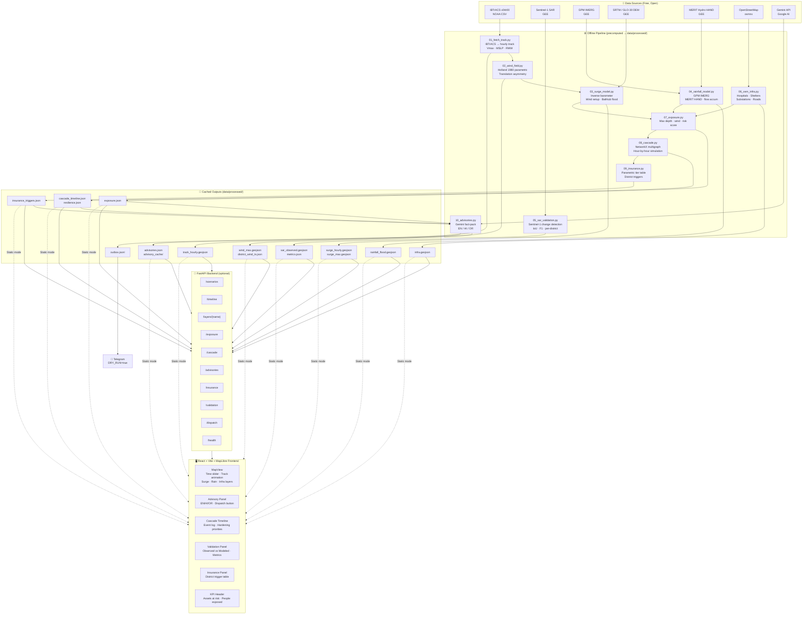

# CycloneShield Architecture

## Overview

CycloneShield is a pre-landfall decision-support platform for cyclone-prone
coastal communities. It ingests freely available data (IBTrACS, Sentinel-1,
GPM IMERG, OpenStreetMap), runs a physics-informed pipeline, and outputs:

- Storm surge and rainfall flood maps (hourly)
- Infrastructure exposure and cascade failure timeline
- AI-generated multilingual advisories
- Parametric insurance triggers
- Automated early-warning dispatch

## System Architecture



## Key Design Principles

### 1. Demo Never Breaks
All GEE and Gemini outputs are pre-computed and cached to `data/processed/`.
The frontend runs in **static mode** loading directly from `/public/data/`.
No runtime dependency on GEE quota or Gemini rate limits.

### 2. No Fabricated Numbers
Every figure in the UI, advisories, or README is computed from data.
Assumptions are documented in code and labelled in the UI.

### 3. Region-Agnostic
A new cyclone scenario requires only a new `config/scenarios/<name>.yaml`.
No code changes needed to add a BRICS Bay of Bengal scenario.

### 4. Free-Tier Throughout
| Component | Service | Cost |
|-----------|---------|------|
| Track data | IBTrACS (NOAA CSV) | Free |
| SAR imagery | Sentinel-1 via GEE | Free (non-commercial) |
| Rainfall | GPM IMERG via GEE | Free (non-commercial) |
| DEM | SRTM/GLO-30 via GEE | Free (non-commercial) |
| Infrastructure | OpenStreetMap | Free (ODbL) |
| AI advisories | Gemini API free tier | Free |
| Frontend hosting | Vercel/Netlify | Free |
| Backend hosting | Render free tier | Free |

## Data Flow Timing

```
T-72h: Pipeline runs offline (once)
T-24h: Cached outputs available → Frontend shows pre-landfall forecast
T+00h: Landfall simulation moment in the slider
T+24h: Post-landfall flood extent from SAR (validation)
```

## Cascade Graph Model

The cascade failure model uses a `networkx.MultiGraph`:

- **Nodes**: substations, hospitals, shelters, district HQ (safe nodes)
- **Edges (dependency)**: hospital ← nearest substation (with generator backup time)
- **Edges (road)**: OSM drive network with flood/wind failure conditions
- **Simulation**: hour-by-hour from T-24h to T+24h
  1. Mark substations failed if flood depth > threshold OR wind > threshold
  2. Hospitals/shelters lose grid power if substation failed AND generator hours elapsed
  3. Remove road edges if flood depth > vehicle-passable threshold
  4. Compute reachability: can any isolated asset reach a safe node?
  5. Log events to cascade_timeline.json

## Advisory Generation

Gemini advisory pipeline:
1. Assemble **fact pack** (JSON): only computed numbers from pipeline
2. Hash fact pack → check cache
3. Call Gemini with strict system prompt (JSON schema output required)
4. Validate output schema (Pydantic)
5. Number-check: every numeric value in output must appear in fact pack
6. Generate in EN → HI → OR (separate calls)
7. Cache all responses by hash

## Limitations

See [LIMITATIONS.md](LIMITATIONS.md) for full scientific caveats.
